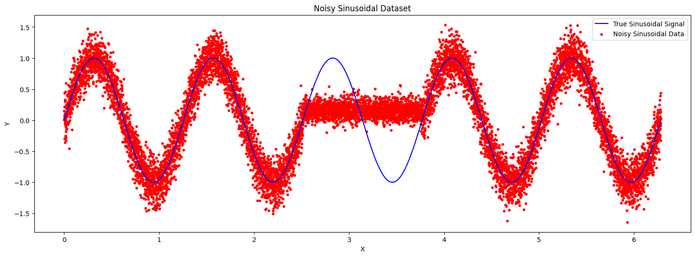
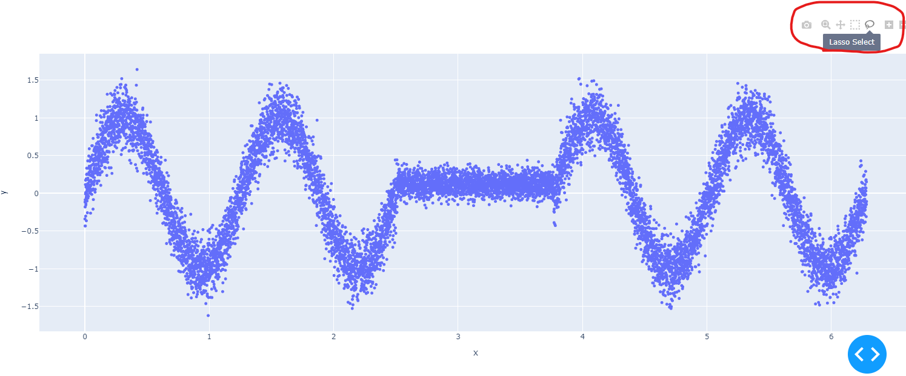
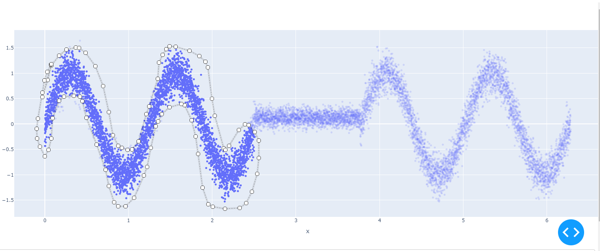
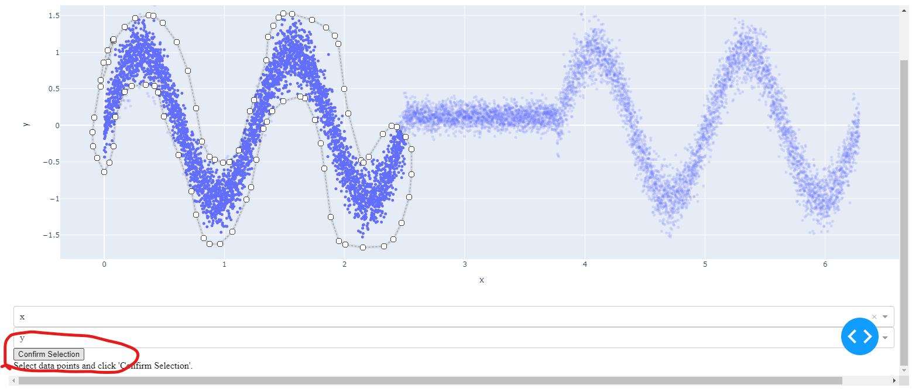
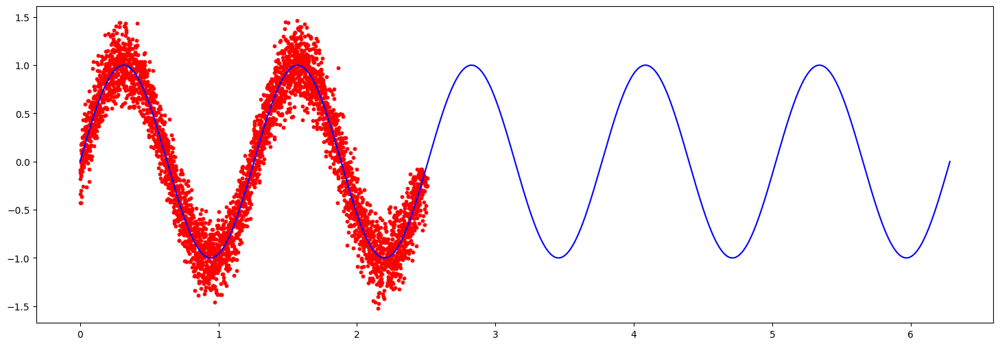

# manual_data_selector
Python package for selecting data manually on a scatter plot.

Source: https://plotly.com/python/v3/selection-events/?_gl=1*1mrgxu1*_ga*MTg2MDIwODQ1Ny4xNzAwNjYwNzI0*_ga_6G7EE0JNSC*MTcwMDY2NTk1Ni4yLjEuMTcwMDY2NjExOS42MC4wLjA.


# DashLassoDataSelector Usage Guide

The `DashLassoDataSelector` is a feature of the `manual_data_selector` package, providing an interactive way to select data from a scatter plot using a lasso tool. This guide describes how to use the `DashLassoDataSelector` in your projects.

## Installation

Install the `manual_data_selector` package using pip:

```bash
pip install manual_data_selector
```

## Usage

Follow these steps to use the `DashLassoDataSelector`:
(Alternatively the 'LassoDataSelector' can be used, but this can't handle larger datasets))

1. **Import the Class:**

   Import the `DashLassoDataSelector` class from the `manual_data_selector` package.

   ```python
   from manual_data_selector.dash_lasso_data_selector import DashLassoDataSelector
   ```

2. **Create an Instance:**

    Create an instance of DashLassoDataSelector.
    You'll need to pass your DataFrame as an argument, and you can optionally specify the figure size and marker size.

    ```python
    # Assuming 'df' is your DataFrame
    # Create a Dash app instance
    app = dash.Dash(__name__)

    # Create a DashLassoDataSelector instance and run it
    dash_app = DashLassoDataSelector(df, app, fig_size=(1600, 600), marker_size=5,port=8000)
    ```

3. **Run and display the Selector:**

    Run the dash_app method to display the interactive scatter plot.
    This plot allows you to select data using the lasso tool.

    ```python
    dash_app.run()
    ```

## Attributes

The `DashLassoDataSelector` class provides several attributes to access the data selected through the interactive scatter plot:

- `selected_data`: This attribute holds the DataFrame of the data currently selected in the scatter plot. It updates dynamically as new selections are made.

- `confirmed_data`: This attribute contains the DataFrame of the last confirmed data. It represents the data that was selected when the user last clicked the 'Confirm Selection' button.

- `all_confirmed_data`: This attribute is a dictionary of DataFrames, where each entry corresponds to a set of data confirmed by the user at different times. Every time the user clicks 'Confirm Selection', the selected data at that moment is stored as a new entry in this dictionary.

## Example

Below is a complete example demonstrating how to use the `DashLassoDataSelector` in your project
(the notebooks folder contains this example with a synthetic dataset):

```python
from manual_data_selector.dash_lasso_data_selector import DashLassoDataSelector
import dash

# Create a Dash app instance
app = dash.Dash(__name__)

# Create a DashLassoDataSelector instance and run it
# Replace 'df' with your DataFrame
dash_app = DashLassoDataSelector(df, app, fig_size=(1600, 600), marker_size=5,port=8000)
dash_app.run()

# After making a selection and clicking 'Confirm Selection',
# you can access the selected data in various ways:

# The data currently selected in the plot
current_data = dash_app.selected_data

# The last set of data confirmed by the user
last_confirmed_data = dash_app.confirmed_data

# All sets of data confirmed by the user over time
all_confirmed_data = dash_app.all_confirmed_data

#transform all selected data into one dataframe
selected_data = pd.concat([dash_app.all_confirmed_data[i] for i in list(dash_app.all_confirmed_data.keys())])
```

## Figures illustrating the DashLassoDataSelector

Below the Figures illustrating the use of the DashLassoDataSelector are shown

### Example Figure 1: Initial Scatter Plot



This figure shows the initial scatter plot from which data is selected.

### Example Figure 2: Activating Selection Lasso Tool



This figure demonstrates how to activate the selection of data points using the lasso tool.

### Example Figure 3: Selection Using Lasso Tool



This figure illustrates the process of selecting data points using the lasso tool.
To perform a selection, press and hold the left mouse button while drawing around the desired data points.

### Example Figure 4: Confirm Data Selection



Confirm selection of step 3.
If you want to add more data, repeat steps 2-4 untill all desired data is selected and confirmed.

### Example Figure 5: Selected Data Illustration



This figure shows the data points that have been selected through Steps 2-4.